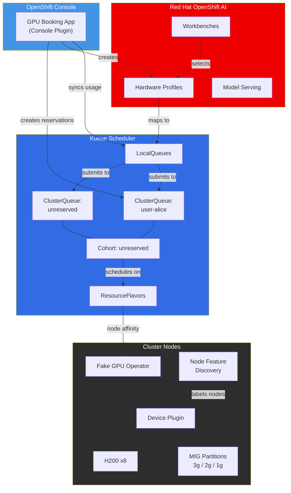
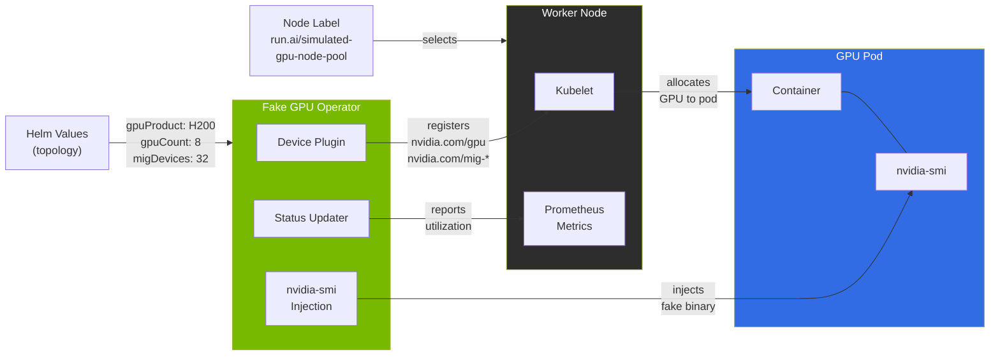
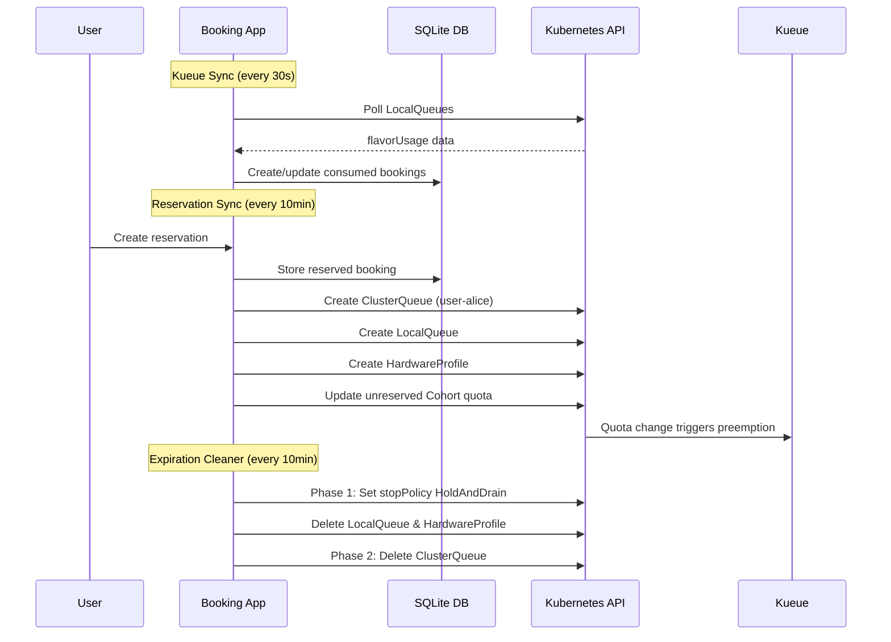
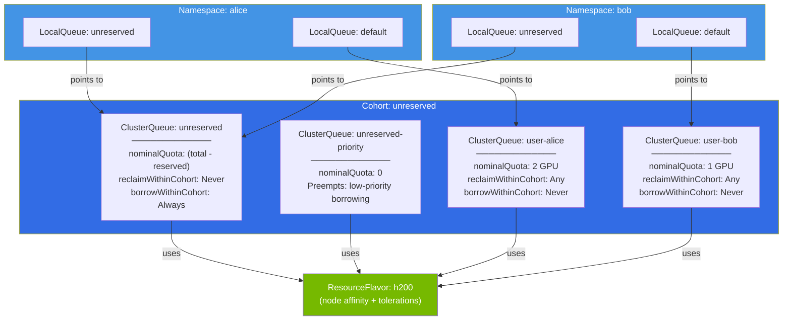
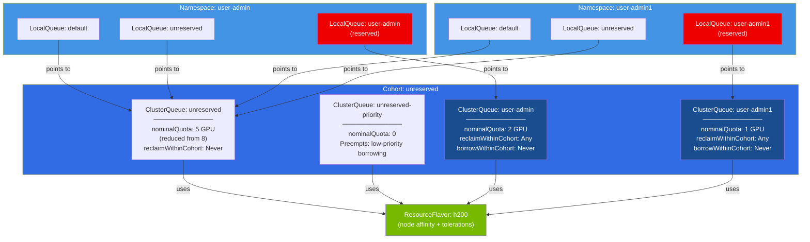
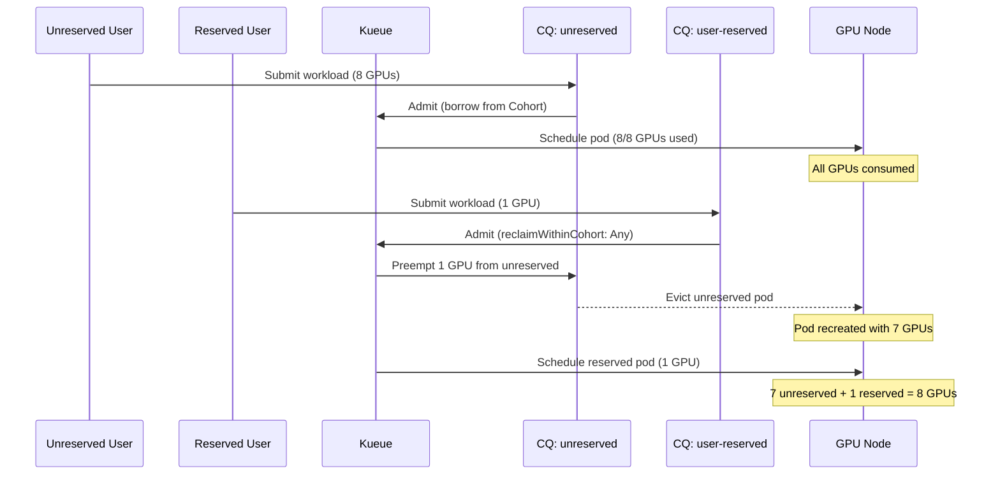

# Workshop Diagrams

Mermaid source for all diagrams used in the workshop.

## 1. Architecture Overview (index.adoc)

## 2. Fake GPU Operator Components (module-01)

## 3. Booking Sync Lifecycle (module-02)

## 4. Kueue Resource Hierarchy (module-04)

## 5. Kueue Hierarchy with Reservations (module-05)

## 6. Preemption Flow (module-05)

